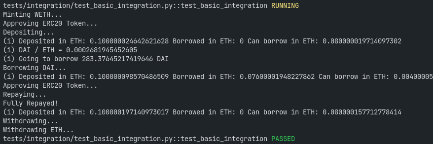

# About
A Brownie suite for basic interaction with the [Aave protocol](https://github.com/aave/protocol-v2). Includes depositing, borrowing, repaying, and other functionality.

Suitable for quantitative defi engineering, as well.
### Example


### Todo
- [ ] Short selling
- [ ] Repaying remaining debt with collateral using flash loans

# Setup
### Clone
```bash
git clone https://github.com/ZeroEkkusu/aave_brownie_py
```
### Prerequisites
- [nodejs and npm](https://nodejs.org/en/download/)
- [python](https://www.python.org/downloads/)
### Requirements
```bash
pip install -r requirements.txt
```
### Other files
Set up your `.env` file using the provided [`.env.example`](./.env.example)
# Usage
- Make sure you have excess DAI in your account before running the integration test - [Kovan DAI Faucet](https://staging.aave.com/#/faucet)
<br>*This will change after implementing the flash loan + swap functionality*
- **Make sure the account is debt-free before testing**
### Compile
```bash
brownie compile
```
### Test
```bash
brownie test
```
# Acknowledgements
This project is based on [PatrickAlphaC/aave_brownie_py](https://github.com/PatrickAlphaC/aave_brownie_py). See [`NOTICE.md`](./NOTICE.md).
